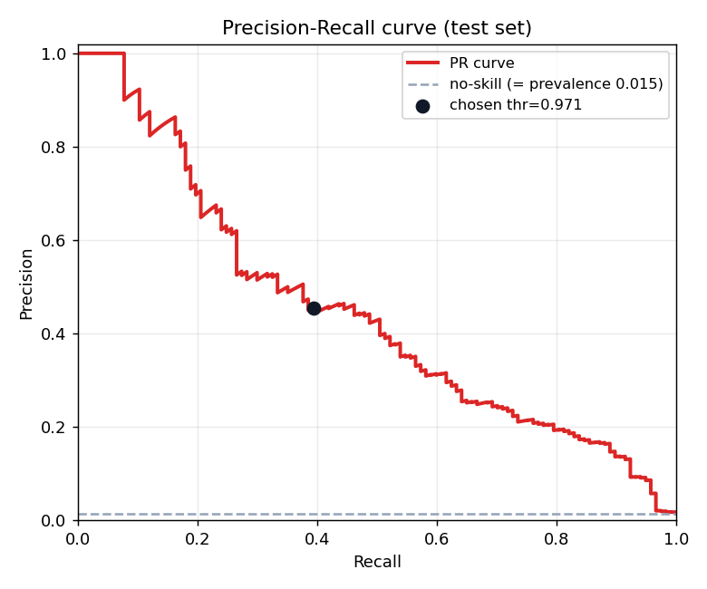
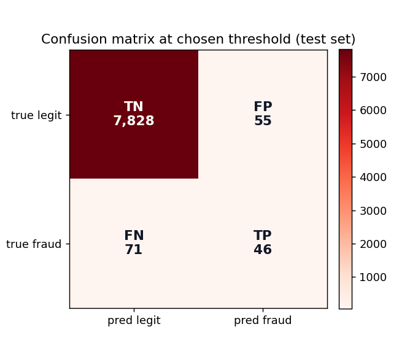

# Fraud Detector

A small, honest fraud-detection ML pipeline for the classic imbalanced
binary-classification problem, plus a live threshold dashboard.

> **Live demo:** https://andreaisabelmontana.github.io/fraud-detector/

The dashboard visualises the precision/recall tradeoff as you drag a decision
threshold. The engine behind it is the **real Python pipeline in this repo** —
trained scikit-learn models, evaluated honestly on held-out data, with the
operating threshold chosen along the precision-recall curve.

## Data

`data/transactions.csv` — **40,000 synthetic transactions**, generated by
[`fraud/make_data.py`](fraud/make_data.py). Not real customer data; the
generative process is fully specified in code so the learnable signal is
auditable:

- **~1.5% fraud** (583 positives) — the heavy class imbalance that makes this
  problem interesting.
- Fraud propensity (log-odds) rises with merchant-category risk, transaction
  amount, distance from home, recent card velocity, late-night hour, and a
  foreign-country flag. Gaussian noise is injected so the classes overlap and
  no model can be perfect.

Regenerate with `python -m fraud.make_data --n 40000 --fraud-rate 0.015`.

## Features

[`fraud/features.py`](fraud/features.py) turns raw rows into a 20-column
numeric matrix: `log1p(amount)`, cyclical hour (`sin`/`cos`) + late-night flag,
distance, velocity, foreign flag, and a fixed one-hot of the 13 merchant
categories.

## Models & imbalance handling

[`fraud/model.py`](fraud/model.py) trains and compares two estimators:

| model | imbalance handling |
|---|---|
| `LogisticRegression` (standardised) | `class_weight="balanced"` — up-weights the rare fraud class in the loss |
| `GradientBoostingClassifier` | tree ensemble for non-linear feature interactions |

The deployed model is selected by **validation PR-AUC**. On this data the
class-weighted logistic model wins (val PR-AUC 0.430 vs 0.330), because the
generative process is largely additive in log-odds.

A dedicated test (`test_class_weight_increases_recall`) confirms the imbalance
handling is doing real work: at a fixed 0.5 threshold, `class_weight="balanced"`
raises recall by more than 0.15 over the unweighted model.

## Threshold / precision-recall tradeoff

A classifier outputs a probability, not a decision — someone must pick the
threshold. [`fraud/metrics.py`](fraud/metrics.py) `select_threshold()` walks the
precision-recall curve and picks the operating point that **meets a precision
floor (0.50) while maximising recall**. The chosen threshold is frozen into the
saved model and used by `predict.py`.

Chosen threshold: **0.971** (validation precision 0.50, recall 0.42).

## Results (held-out test set)

Real numbers from `python train.py`, written to
[`results.json`](results.json). Accuracy is reported but **not** headlined — on
1.5% positives, a "never fraud" model already scores ~98.5%.

| metric | value |
|---|---|
| Precision | **0.455** |
| Recall | **0.393** |
| F1 | **0.422** |
| ROC-AUC | **0.949** |
| PR-AUC | **0.446** |
| Accuracy | 0.984 *(not a headline)* |

Confusion matrix at the chosen threshold: TP 46 · FP 55 · FN 71 · TN 7,828.

PR-AUC of 0.446 is **~30× the no-skill baseline** (= prevalence ≈ 0.015), and
ROC-AUC 0.949 shows the model ranks fraud far above legit transactions. The
modest absolute precision/recall is honest: the synthetic signal carries real,
irreducible noise.

### Figures

| | |
|---|---|
|  |  |

## Run it

```bash
pip install -r requirements.txt

python -m fraud.make_data --n 40000   # (optional) regenerate data/transactions.csv
python train.py                       # fit, evaluate, save model + results.json + figures
python predict.py --demo              # score example transactions
python -m pytest -q                   # 9 tests
```

Score a single transaction:

```bash
python predict.py --json '{"amount": 2400, "hour": 3, "category": "luxury",
  "distance_from_home": 180, "txns_last_hour": 5, "is_foreign": 1}'
```

## Layout

```
fraud-detector/
├── fraud/
│   ├── make_data.py   synthetic imbalanced transactions generator
│   ├── features.py    raw rows -> numeric design matrix
│   ├── metrics.py     imbalanced-aware metrics + PR-curve threshold selection
│   └── model.py       estimators, FraudModel wrapper, score() API, persistence
├── train.py           fit + honest evaluation + save model/results/figures
├── predict.py         score a transaction with the trained model
├── tests/             pytest suite (9 tests)
├── data/              transactions.csv, model.pkl
├── figures/           pr_curve.png, confusion_matrix.png
├── results.json       metrics from the last training run
└── index.html         live threshold dashboard (visualises the classifier)
```

The browser dashboard is a visualisation layer; the classifier engine is the
Python above. All data is synthetic — no real transactions, no real cardholders.

— Andrea Montana · IE School of Science & Technology
